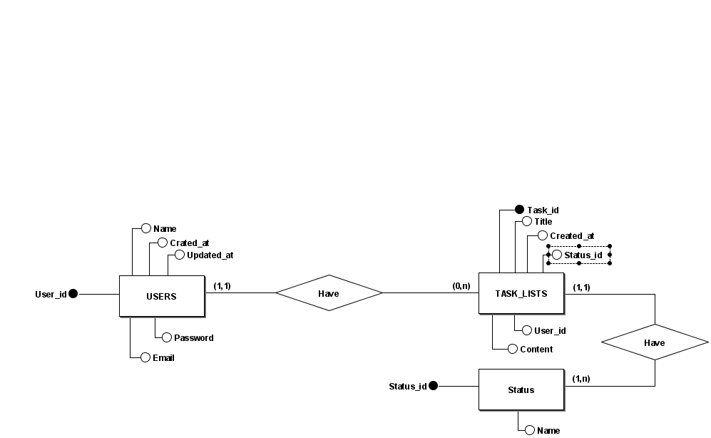

# 📝 Projeto - ToDoList 

Uma aplicação ToDo List, onde usuários podem criar, editar, listar e atualizar suas tarefas, além de utilizar status para organizar. Projeto de aprendizado de conceitos de modelagem de dados, autenticação de usuários, CRUD, utilização de API e tentativa de aplicação dos conceitos SOLID.

## 🚀 Funcionalidades a serem implementadas

- Cadastro e login de usuários
- Criação de tarefas com título, conteúdo e status
- Listagem de tarefas por usuário
- Atualização e exclusão de tarefas
- Filtro de tarefas por status (pendente, em andamento, concluída, etc.)

## 🧠 Modelo Conceitual



  > O projeto segue uma estrutura relacional com três entidades principais: `Users`, `Tasks` e `Status`.

## 🛠️ Tecnologias Utilizadas

- 💻 Linguagem: C#
- 📦 Backend: ASP.NET Core utilizando Entity Framework 
- 🗃️ Banco de Dados: SQL Server
- 🔐 Autenticação: JWT 
- 📁 ORM: Entity Framework Core
- 🌐 Comunicação: A comunicação entre a aplicação utiliza API através de requisições HTTP 
- 🏗️ Arquitetura: Estou aprendendo os conceitos SOLID, então busquei implementá-los na aplicação

```
## 📂 Estrutura do Projeto

ToDoListAPI/
├── 📁 API/
│   ├── StatusController.cs
|   ├── TaskController.cs
|   └── UserController.cs
|
├── 📁 Application/          
│   ├── 📁 Services.cs
|   |   ├── StatusService.cs
|   |   ├── TaskService.cs
|   |   ├── TokenService.cs
|   |   └── UserService.cs
|   |
|   └── 📁 Utils.cs
|       └── JwtUtils.cs
|
├── 📁 Domain/ 
|   ├── 📁 DTOs (Não implementado ainda)
|   |
|   ├── 📁 Entities
|   |   ├── 📁 Base
|   |   |   └── BaseEntity.cs
|   |   |
|   |   ├── Status.cs
|   |   ├── TaskModel.cs
|   |   ├── Token.cs
|   |   └── User.cs
|   |
|   └── 📁 Interfaces        
|       ├── 📁 Base
|       |   └── IBaseRepository.cs
|       |
|       ├── IJwtTokenRepository.cs
|       ├── IStatusRepository.cs
|       ├── ITaskModelRepository.cs
|       └── IUserRepository.cs
|
└── 📁 Infrastructure/
    ├── 📁 Context           
    |   └── ApplicationDbContext.cs
    |
    └── 📁 Repositories
        ├── 📁 Base
        |   └── BaseRepository.cs
        |
        ├── StatusRepository.cs
        ├── TaskModelRepository.cs
        ├── TokenRepository.cs
        └── UserRepository.cs

```